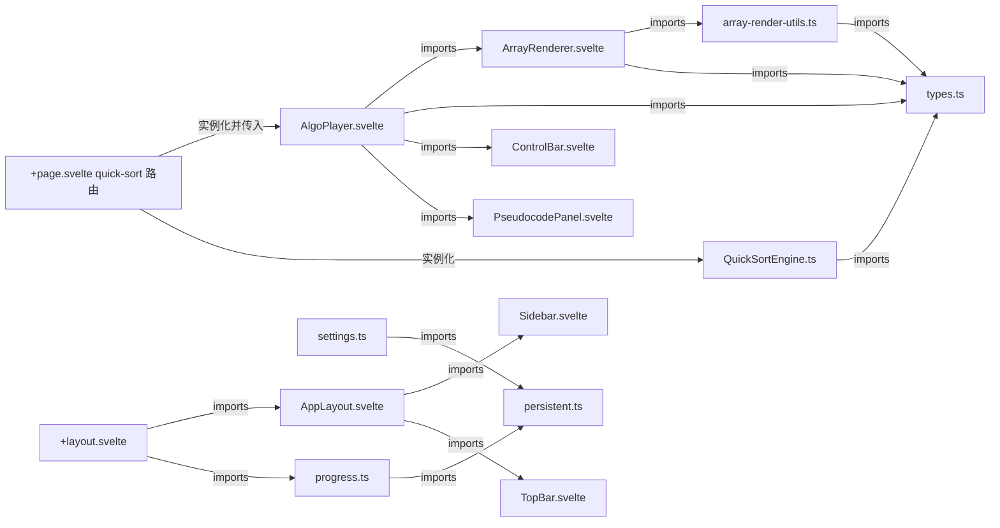

# 依赖关系 — Dependencies

> generated_by: nexus-mapper v2
> verified_at: 2026-08-01
> provenance: TypeScript import 边为 AST-backed；Svelte 组件 import 边为 inferred from manual inspection（svelte module-only 覆盖）；planned 边 inferred from design doc

## 系统级依赖图

```mermaid
graph TD
    UI[ui-layout 布局与页面层] -->|页面组合 AlgoPlayer| PL[player-visualization 播放器与可视化层]
    UI -->|+layout 调用 updateStreak| ST[state-layer 本地持久化状态层]
    PL -->|消费 AlgorithmEngine 接口| AE[algo-engine 算法步进引擎层]
    ST -.规划: 进度主题 id 关联.-> CD[content-data 教材内容数据层]
    SE[sql-engine SQL 引擎层] -.规划: v0.1-M2 待实现.-> UI
```

数据流方向（架构文档 §3.8 单向数据流，实现已遵守）：控制面板 → 引擎 → 视图（Canvas/伪代码/状态栏）。

## 模块级依赖



外部依赖：`gsap`（唯一 runtime 依赖，AlgoPlayer 使用 timeline）；`$app/environment`、`$app/stores`、`svelte/store`（框架）；`vitest`、`@tailwindcss/vite`、`@sveltejs/adapter-static`、`@sveltejs/kit/vite`（构建/测试）。

## 依赖方向审计

- 分层方向（UI → Player → Engine → Data）正确，**未发现下层 import 上层**的违反
- `QuickSortEngine` 是纯逻辑模块，AST 确认唯一内部依赖是 `../types` — 符合"引擎与渲染解耦"的设计约束
- **注意**：`array-render-utils.ts` 依赖 `$lib/engines/algorithm/types`（渲染层 → 引擎层契约），这是有意为之（HighlightType 渲染颜色映射），不视为反向依赖

## 接线状态矩阵（2026-08-01 更新：阶段 A 已接线）

| 已定义接口/数据 | 定义位置 | UI 调用方 | 状态 |
|----------------|---------|----------|------|
| `practiceQuestions` 练习系统 | QuickSortEngine.ts:41 | **已接线**：AlgoPlayer + PracticePanel（暂停出题/判错/提示/解析） | 已打通 |
| `addMistake` / `updateTopicMastery` | stores/progress.ts:45,69 | **已接线**：答对 +10 掌握度；答错记错题本 | 已打通 |
| progress store 数据 | stores/progress.ts | **已接线**：/progress 页展示掌握度/错题/streak | 已打通 |
| settings store | stores/settings.ts | 无 /settings 路由 | 断层 |
| `updateStreak()` | stores/progress.ts:85 | +layout.svelte:12 | 已接线 |

> 接线点注意：`PracticePanel.svelte`（新组件，练习弹层）；AlgoPlayer 新增 `topicId`/`topicName` props（页面传入）；练习面板打开时 ControlBar 禁用快捷键、播放器操作被拦截（不可跳过答题）。

## 证据缺口

- svelte 组件 import 关系为人工阅读推断（AST 仅覆盖 .ts）
- sql-engine/content-data 相关边均为规划文档推断，仓库中无对应代码
- git 无历史：无 co-change 耦合数据
