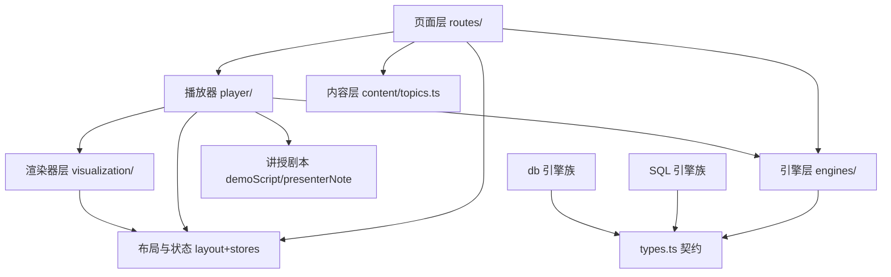

# 系统间依赖关系

> generated_by: nexus-mapper v2
> verified_at: 2026-08-03
> provenance: TypeScript import 由 AST 支撑（Node 级 imports 边 174 条内部边）；Svelte 组件依赖 inferred from manual inspection（svelte 无结构查询，module-only 覆盖）；inferred 边已标注

## Mermaid 依赖图

## 关键依赖事实

| 关系 | 方向 | 证据 |
| --- | --- | --- |
| 引擎契约 | E/SQL/db → types.ts | AST 13 个 Class 节点全部 implements `AlgorithmEngine` |
| 播放器 → 引擎 | P → E | AlgoPlayer props 类型 `AlgorithmEngine<unknown>`，页面创建实例传入 |
| 播放器 → 渲染器 | P → V | AlgoPlayer 模板按 `engine.renderType` 分发 array/tree/linkedlist/sqltable/stack/er/btree（inferred，Svelte 模板） |
| 播放器 → 讲授剧本 | P → N | 投影模式读 `engine.demoScript` + `step.presenterNote`（v0.3 新增边） |
| 渲染器 → token | V → app.css | `resolveCSSVar`/`watchThemeChange` 读主题 token（inferred） |
| 播放器 → 进度 | P → progress store | `updateTopicMastery`/`addMistake` 由 PracticePanel 答题触发 |
| 目录页 → 内容 | R → C | `/`、`/ds`、`/db` 用 `dsTopics`/`dbTopics`（inferred，Svelte 模板） |
| 布局 → 设置 | L → settings store | TopBar toggleTheme；`+layout.svelte` `$effect` 同步 `<html class="dark">` |

## 分层方向（无反向违规）

- 引擎层不 import 渲染器/播放器/页面（纯数据生成）→ 引擎可独立测试
- 渲染器只读 engine.steps + CSS token，不触碰 store/路由
- 页面是组装器：创建引擎、传入播放器、维护数据面板状态

## inferred 标注

- 所有 Svelte 组件间 `depends_on` 边为 manual inspection（svelte 无 AST import 边）
- `animejs`（devDependencies）无源码引用，推断为遗留依赖，不影响依赖图

## 风险提示

- `types.ts`（AlgorithmStep/AlgorithmEngine）是全局契约，改动影响全部 13 引擎 + 播放器 + 渲染器（影响半径最大）；v0.3 在契约上只加可选字段（demoScript/presenterNote），向后兼容已验证
- `app.css` token 被全部 7 渲染器 + 布局引用，重命名 token 需同步 visualization-utils
- `AlgoPlayer.svelte` 承担三模式 + 弹窗 + 键盘 + 全屏，是本仓库单文件复杂度最高的组件（~1150 行含样式），新模式继续加进去前需评估拆分