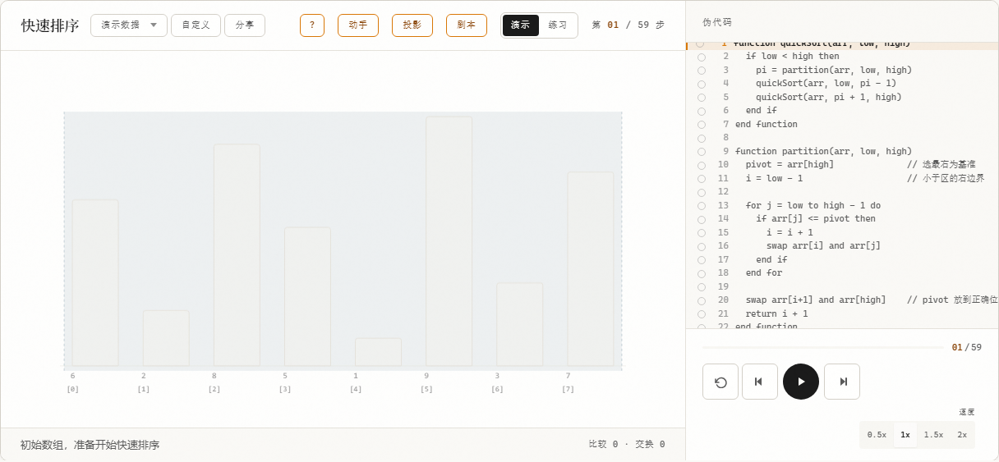
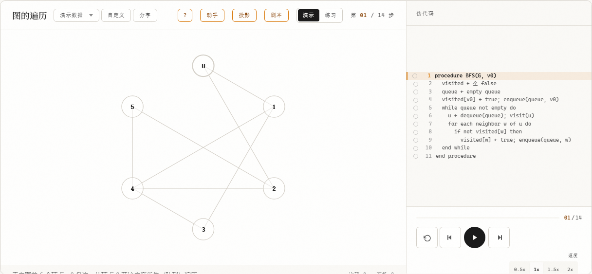

<div align="center">

# StructVis

**看见数据结构与数据库的每一步跳动。**

面向自学者的交互式可视化学习工具——数据结构与 MySQL 数据库双课程，过程可步进、可交互、可试错。

[](https://work.feng-qiao.top/struct/)
[](#6-质量与测试)
[](#8-许可)

**87 个知识点** · **100 个页面** · **22 类渲染器** · SQL 本地真实执行 · 零账号 · 零上传

</div>

<hr>

<div align="center">

|                                       快速排序播放器                                        |                                        SQL 结果演化                                        |
| :-----------------------------------------------------------------------------------------: | :----------------------------------------------------------------------------------------: |
|  |  |

</div>

## 目录

1. [Introduction](#1-introduction)
2. [Highlights](#2-highlights)
3. [课程全景](#3-课程全景)
4. [Quick Start](#4-quick-start)
5. [Architecture](#5-architecture)
6. [质量与测试](#6-质量与测试)
7. [Contributing](#7-contributing)
8. [许可](#8-许可)
9. [联系与支持](#9-联系与支持)

## 1. Introduction

StructVis 是一款围绕教材章节设计的**过程型学习环境**，覆盖《数据结构教程》（李春葆，第 5 版）与《数据库技术及应用（MySQL）》（杨宏霞）两门课程。

它不是算法 Demo 集，也不是题库刷题平台，而是把「看懂 → 做对 → 记住」做成一条完整闭环：

- **看懂**：每个执行过程逐帧播放、任意回退，动画与伪代码双向同步高亮；
- **做对**：四类练习题型即时判定解析；**SQL 工作台** 8 个关卡亲手写 SQL、sql.js 浏览器内真实执行、自动判分回写掌握度；
- **记住**：错题自动进错题本，SRS 间隔复习排期；每日一题、连续天数、掌握度雷达形成完整学习数据。

全部学习数据仅存于浏览器 localStorage——零账号、零上传、可随时导出备份。

## 2. Highlights

**学习 · 可视化**

- 87 个知识点全部步进可视化：排序 / 树 / 图 / 线性结构 / 查找 / 动态规划 / 回溯 + MySQL 全链路（查询 / 索引 / 事务 / 范式 / SQL 实验台）
- 22 类 Canvas 渲染器按引擎插件化；播放器支持逐帧、回放、调速、伪代码断点、自定义数据重建
- SQL 剧本站：19 个主题逐帧**真实执行**（sql.js 内存库，SQLite 方言演示，数据不出浏览器）

**练习 · 闭环**

- SQL 工作台关卡制：任务卡 → 亲手写 SQL → 真实执行 → 三类判分器自动判定 → 掌握度回写
- 四类题型（选择 / 填空 / 拖指针 / 补代码）+ 章节自测 + 每日一题（全网同题）
- 错题本 + SRS 间隔复习（1/3/7/14/30 天阶梯），到期自动提醒

**界面 · 质感**

- 全端统一移动应用范式：hub 首页 + 底部导航（玻璃滑块可拖拽切换）
- iOS 液态玻璃体系：卡片磨砂 + 3D 微悬浮 + 光效，大面容器深磨砂
- 亮暗双主题（AA 对比度基线）· 移动端适配 · prefers-reduced-motion 全降级

**工具 · 延伸**

- 竞速实验室（30 个排序引擎同屏，经典 × 玩梗）· 技能图谱（前置依赖双轨道）· 学习报告（雷达 / 热力图 / 分享图）
- 讲授投影模式 + 讲授剧本导入导出 + 预录语音朗读
- 全局搜索（`/` 或 Ctrl+K，课题 + 47 组别名）

## 3. 课程全景

| 模块       | 课题数 | 内容                                                                                                                                           |
| :--------- | :----: | :--------------------------------------------------------------------------------------------------------------------------------------------- |
| 数据结构   |   49   | 排序 ×10 · 树 ×7 · 图 ×14 · 线性结构 ×9 · 查找 ×4 · 动态规划 ×6 · 回溯                                                                         |
| MySQL 课程 |   24   | 查询 / 窗口函数 / 执行计划 / 建表 / 更新 / 视图 / 触发器 / 存储过程 / E-R / 范式 / 事务 / 锁 / 复制 / 架构 …                                   |
| SQL 实验台 |   14   | 集合运算 / CASE / 函数 / HAVING / 分页 / JOIN 家族 / 视图更新 / 索引失效 / EXPLAIN / 约束 / 回表 / 锁甘特图 / 可串行化 / **SQL 工作台 8 关卡** |

> 数字以 [topics.ts](structvis/src/lib/content/topics.ts) 单源派生，目录页 / 侧栏 / 搜索 / 图谱自动同步。

## 4. Quick Start

**在线使用（推荐）**：<https://work.feng-qiao.top/struct/> —— 打开即学，无需安装。

**本地开发**：

```bash
git clone https://github.com/zep4yrs/struct.git
cd struct/structvis
npm install
npm run dev        # http://localhost:5173/struct/
```

常用命令：

| 命令               | 说明                                          |
| ------------------ | --------------------------------------------- |
| `npm run test`     | 单元测试（491 条，Vitest 双项目）             |
| `npm run test:e2e` | 端到端测试（71 条 Playwright，含视觉基线）    |
| `npm run check`    | svelte-check 类型检查                         |
| `npm run lint`     | Prettier + ESLint + README 数字防漂移校验     |
| `npm run build`    | 生产构建（输出到仓库根 `docs/`，CI 自动部署） |

## 5. Architecture

Svelte 5（runes）· SvelteKit · Tailwind v4 · anime.js v4 · three.js · sql.js（可选依赖，构建自动携带）· Web Speech API · Vitest + Playwright · adapter-static 纯静态部署。

```
structvis/src/
├── lib/
│   ├── engines/          # 算法/SQL/DB 引擎（AlgorithmEngine 契约，纯逻辑，配 .spec.ts）
│   │   └── sql/scripts/  # SQL 剧本（seed + 帧）+ 工作台关卡（判分器纯函数）
│   ├── visualization/    # 22 类 Canvas 渲染器（按 engine.renderType 插件化）
│   ├── components/       # player / layout / ui（AlgoPlayer · ScriptPlayer · 底部导航…）
│   ├── content/          # topics.ts（课题单源）+ skill-graph + chapters + 守卫 spec
│   └── stores/           # progress / settings（版本信封迁移，绝不覆盖损坏数据）
├── routes/               # 100 个页面（/、/home、/catalog、/sprint、ds×49、db×38…）
└── e2e/                  # Playwright（含视觉截图基线）
```

三条核心管线：

1. **引擎 → 关键帧 → 时间线 → 渲染器**：引擎纯逻辑产出步骤快照，anime.js Timeline 驱动，渲染器按 renderType 分发；
2. **SQL 剧本站**：seed.sql 装载 sql.js 内存库 → 帧序列真实执行 → 结果演化动画（未启用 sql.js 时静态演示帧兜底）；
3. **单源内容体系**：topics.ts 是课题唯一数据源，目录 / 侧栏 / 搜索 / 图谱 / 报告章节全部派生，CI 校验防漂移。

## 6. 质量与测试

- **491 条单元测试**（Vitest server + client 双项目）：引擎关键帧、SQL 判分器、存储迁移、渲染器快照
- **71 条端到端测试**（Playwright）：播放器交互 / SQL 剧本冒烟 / 工作台判分 / 移动端 375px / 视觉基线
- 门禁全绿是合并前提：`lint`（含 README 数字校验）→ `check` → `test` → `test:e2e`，CI 与本地同套

## 7. Contributing

新增一门课程只需三步（详见 [structvis/README.md](structvis/README.md)）：

1. `src/lib/engines/` 实现引擎（implements AlgorithmEngine，配单测）
2. `src/lib/content/topics.ts` 加一条课题记录——目录 / 侧栏 / 搜索 / 图谱自动同步
3. 新建路由页组装 `AlgoPage` + 播放器，跑通三道质量门禁

提交前确保 `npm run lint && npm run check && npm run test` 全绿。

## 8. 许可

[GPL-3.0](LICENSE)。Copyright (c) 2026 枫桥 (zep4yrs)。

你可以自由使用、修改、分发本项目，但**基于本项目的衍生作品必须同样以 GPL-3.0 开源**。

## 9. 联系与支持

- 在线体验：<https://work.feng-qiao.top/struct/>
- 问题反馈：[Issues](https://github.com/zep4yrs/struct/issues)
- 如果 StructVis 帮到了你，欢迎[请作者喝杯咖啡](https://afdian.net/a/zep4yrs)——全部学习功能永久免费。

---

<details>
<summary><b>文档维护约定（给贡献者，含未来作者自己）</b></summary>

- 知识点数 / 页面数 / 渲染器数等**一切数字以源码为准**：topics.ts、routes 目录是唯一事实来源，README 不手写估算值
- `npm run lint` 内置 check-docs 校验：README 数字与源码不一致时直接红
- 测试规模变化时更新徽章与 Quick Start 表格；应用内 `/about` 关键数字已是派生值，无需手改

</details>
